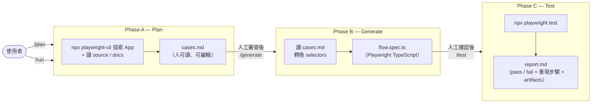

# QA Engine

AI 驅動的 QA 測試系統，透過 Claude Code 與 `npx playwright-cli`，對 web 應用執行系統性流程驗證。

**核心設計**：三階段 workflow（Plan → Generate → Test），每階段產出獨立可稽核的檔案，中間可人工介入審查。

---

## 架構

```
Claude Code
    ↕ slash commands (/plan /generate /test /run)
 Flow-Guard (defined in CLAUDE.md)
    ↕ Bash (Phase A)
npx playwright-cli
    ↕
  Browser
    ↓
目標 Web App
```

產出物：

```
tests/generated/<timestamp>/
    cases.md          ← Phase A：人可讀、可編輯的測試案例
    flow.spec.ts      ← Phase B：Playwright TypeScript spec

reports/
    report-<timestamp>.md     ← Phase C：測試結果報告
    snapshots/<timestamp>/    ← Phase C：失敗截圖（自動收集）
    traces/<timestamp>/       ← Phase C：Playwright trace（自動收集）

playwright/.auth/
    state.json        ← 登入狀態（gitignored）
```

---

## 三階段 Workflow



| Phase | 指令 | 輸入 | 輸出 |
|---|---|---|---|
| A — Plan | `/plan` | target URL + (source) + (docs) | `cases.md` |
| B — Generate | `/generate` | `cases.md` | `flow.spec.ts` |
| C — Test | `/test` | `flow.spec.ts` | `report.md` |
| 全流程 | `/run` | 同 /plan | 上述全部 |

**為什麼分階段**：拆成三個單一職責的階段，每階段 AI 只需專注做一件事。中間產物可審查、可修改、可重跑。

---

## 指令說明

### `/plan` — Phase A：探索 → cases.md

```
/plan
target: http://localhost:3000
source: ../my-app/src    # optional — 白箱分析
docs: ./prd.md           # optional — PRD / spec
```

AI 透過 `npx playwright-cli` 瀏覽目標 app，結合 source code 和 PRD（若提供），產生 `cases.md`。

**Role-based branching**：若流程有多個角色（例如 manager / employee），Phase A 會：
1. 從 PRD 判斷角色差異（有 `docs` 時）
2. 從 source code 找 role enum / role-check 邏輯（有 `source` 時）
3. 請使用者說明機制（兩者都沒有時）

每個角色生成獨立的 TC，命名含 role（例如 `TC-001: Manager 申請假單`），步驟完整自給自足。

完成後等候使用者審查 `cases.md`。

---

### `/generate` — Phase B：cases.md → spec.ts

```
/generate <folder>    # folder = tests/generated/<timestamp>，不帶則用最新的
```

讀取 `cases.md`，產生 `flow.spec.ts`：
- playwright-cli refs 轉換為穩定 selector（`getByRole` / `getByLabel` / `data-testid`）
- 同一流程的多個 role 分支放在同一 `test.describe()` 區塊
- TypeScript compile 通過後停下，告知使用者執行 `/test`

---

### `/test` — Phase C：跑測試 → 報告

```
/test <folder>    # folder = tests/generated/<timestamp>，不帶則用最新的
```

```bash
npx playwright test <folder>/flow.spec.ts
```

解析結果，產生 `reports/report-<ts>.md`，包含：
- 總覽表（Total / Passed / Failed / Duration）
- 每個 TC 的狀態
- 失敗的 TC 附上最小重現步驟（Playwright code）
- 失敗截圖與 trace 路徑（若有）

---

### `/run` — 全流程（不中斷）

```
/run
target: http://localhost:3000
source: ../my-app/src
docs: ./prd.md
```

依序執行 Phase A → B → C，不在中間等待。適合自動化或快速驗證。

---

## 輸入參數

| 參數 | 必填 | 說明 |
|---|---|---|
| `target` | 是 | 測試目標 URL |
| `source` | 否 | 目標 app 的 source code 目錄（白箱分析） |
| `docs` | 否 | PRD / spec 的 URL 或本地路徑 |

---

## 設定

### 1. 安裝依賴

```bash
npm install
npx playwright install chromium
```

### 2. 設定憑證

```bash
cp .env.example .env
```

必填：

```
TSSO_USERNAME=...
TSSO_PASSWORD=...
```

`.env` 已被 `.gitignore`，不會進版控。

---

## 目錄結構

```
qa-engine/
├── CLAUDE.md                     ← Flow-Guard 核心定義
├── playwright.config.ts          ← Playwright 執行設定（Phase B 自動產生）
├── playwright.config.base.ts     ← 手動維護的基礎設定
├── package.json
├── .env.example                  ← 憑證範本
│
├── .claude/
│   ├── settings.json             ← 工具白名單（CLI-only）
│   └── commands/
│       ├── plan.md               ← /plan
│       ├── generate.md           ← /generate
│       ├── test.md               ← /test
│       ├── run.md                ← /run
│       └── test-cases.md         ← Phase A 探索邏輯
│
├── playwright/
│   ├── auth.setup.ts             ← TSSO 登入流程
│   └── .auth/
│       └── state.json            ← 登入狀態（gitignored）
│
├── tests/
│   └── generated/                ← 每次 /run 自動產生（gitignored）
│       └── <YYYYMMDD-HHMMSS>/
│           ├── cases.md
│           └── flow.spec.ts
│
└── reports/                      ← 測試執行產物（gitignored）
    ├── report-<timestamp>.md
    ├── snapshots/<timestamp>/    ← 失敗截圖
    └── traces/<timestamp>/       ← Playwright trace
```

---

## CI

直接用 `npx playwright test` 跑已生成的 spec（不透過 AI）：

```bash
# 單一 run 的所有 spec
npx playwright test tests/generated/<timestamp>/

# 指定 case
npx playwright test tests/generated/<timestamp>/flow.spec.ts --grep "TC-001"
```
