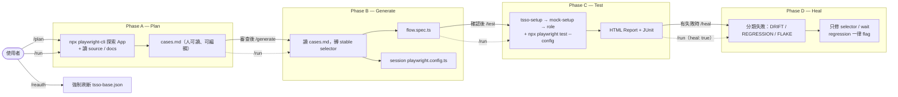

# QA Engine

AI 驅動的 QA 測試系統，透過 **Claude Code** 與 `npx playwright-cli`，對 web 應用執行系統性流程驗證。

**核心設計**：四階段 workflow（Plan → Generate → Test → Heal），每階段產出獨立可稽核的檔案，中間可人工介入審查。Heal 階段只修「測試漂移」，絕不掩蓋真實 regression。

---

## 架構

```
Claude Code
    ↕ slash commands (/plan /generate /test /heal /run /reauth)
 Flow-Guard (defined in CLAUDE.md)
    ↕ Bash (Phase A / Phase D)
npx playwright-cli
    ↕
  Browser
    ↓
目標 Web App
```

產出物（每個 session 自給自足，永遠用 `--config` 指向自己那份）：

```
tests/generated/<timestamp>/
    cases.md                     ← Phase A：人可讀、可編輯的測試案例
    flow.spec.ts                 ← Phase B：Playwright spec（單 role）
    flow.{role}.spec.ts          ← Phase B：Playwright spec（多 role，一 role 一檔）
    playwright.config.ts         ← Phase B：本 session 的權威設定（import 根目錄的 factory）
    mock-user.setup.ts           ← Phase A：mock user 設定腳本
    mock-users.json              ← Phase A：mock user 資料（含 baseURL）
    heal-<HHMMSS>.patch          ← Phase D：本次 heal 的 unified diff（稽核用）
    .auth/
        state-{role}.json        ← Phase C runtime 產生（gitignored）

playwright-report/    ← Phase C：HTML 測試報告（npx playwright show-report）
test-results/         ← Phase C：JUnit XML + traces（自動收集）

playwright/.auth/
    tsso-base.json    ← TSSO 基礎 session（gitignored，tsso-setup project 每次 run 產生）
```

> **設定模型**：根目錄 `playwright.config.ts` 是**唯讀 resolver**（找最新 session，僅供本機方便），`playwright.config.base.ts` 是人工維護的 **factory**。真正權威的是每個 session 內的 `playwright.config.ts`。CI／指定 session 一律帶 `--config`。

---

## 四階段 Workflow



| Phase        | 指令          | 輸入                                        | 輸出                                          |
| ------------ | ----------- | ----------------------------------------- | ------------------------------------------- |
| A — Plan     | `/plan`     | target URL + (source) + (docs) + (locale) | `cases.md`                                  |
| B — Generate | `/generate` | `cases.md`                                | `flow.spec.ts` + session `playwright.config.ts` |
| C — Test     | `/test`     | `flow.spec.ts`                            | HTML report + JUnit                         |
| D — Heal     | `/heal`     | Phase C 失敗結果（test-results）              | 修好的 spec.ts + heal 報告 + `.patch`        |
| 全流程          | `/run`      | 同 /plan（可加 `heal: true`）                  | 上述全部                                      |
| 重新登入         | `/reauth`   | `.env` 憑證                                 | `playwright/.auth/tsso-base.json`           |

**為什麼分階段**：拆成單一職責的階段，每階段 AI 只專注一件事，中間產物可審查、可修改、可重跑。Heal 獨立成階段，是為了讓「修測試」這件事永遠在人能看見的邊界內進行。

---

## 指令說明

### `/plan` — Phase A：探索 → cases.md

```
/plan
target: http://localhost:3000
source: ../my-app/src    # optional — 白箱分析
docs: ./prd.md           # optional — PRD / spec
```

AI 透過 `npx playwright-cli` 瀏覽目標 app，結合 source code 和 PRD（若提供），產生 `cases.md`，完成後等候審查。多角色流程會從 PRD／source 判斷角色差異，每個角色生成獨立、自給自足的 TC。

### `/generate` — Phase B：cases.md → spec.ts

```
/generate <folder>    # folder = tests/generated/<timestamp>，不帶則用最新
```

讀取 `cases.md`，產生 `flow.spec.ts` 與本 session 的 `playwright.config.ts`：playwright-cli refs 轉成穩定 selector（`getByRole` / `getByLabel` / `data-testid`），TypeScript 編譯通過後停下。

### `/test` — Phase C：跑測試 → 報告

```
/test <folder>    # 不帶則用最新
```
```
npx playwright test --config tests/generated/<timestamp>/playwright.config.ts
```

setup chain 依序跑 `tsso-setup → mock-setup → role 測試`，解析結果輸出摘要（Total / Passed / Failed / Duration、每個 TC 狀態、失敗 TC 的錯誤摘要）。完整截圖與 trace：`npx playwright show-report`。

### `/heal` — Phase D：分類失敗 → 修漂移、flag regression

```
/heal <folder>    # 不帶則用最新
```

讀 Phase C 的 `test-results/`，先用 `npx playwright-cli` 重新探索取得 fresh snapshot，再把每個失敗 TC 分類：

- **DRIFT**（元素還在、selector 失準）→ 重解成穩定 selector 並 patch
- **FLAKE**（純等待不足）→ 只調等待
- **REGRESSION / TEST-DEFECT / AUTH** → **不改任何東西，直接 flag**

修過的 TC 以 `--repeat-each=3` 重跑驗證，3/3 才算修好。**絕不修改斷言、不加 skip/sleep 來逼綠燈。** 任何 REGRESSION 被 flag，該次 run 就不會報告為綠。

### `/run` — 全流程

```
/run
target: http://localhost:3000
source: ../my-app/src
docs: ./prd.md
heal: true            # optional — Phase C 有失敗時自動接 Phase D（預設 false）
```

依序 Phase A → B → C，`heal: true`（或 `AUTO_HEAL=true`）時 C 後若有失敗自動跑一次 Phase D。自動模式下 healer 不會卡問題：ambiguous 一律判 REGRESSION 並 flag。

### `/reauth` — 重新整理登入狀態

```
/reauth
```

手動強制刷新 `playwright/.auth/tsso-base.json`，不動 `cases.md`、`spec.ts`、session 資料。當 tsso-setup 的快取判斷不夠、或登入確定過期時使用。

---

## 輸入參數

| 參數       | 必填 | 說明                                            |
| -------- | --- | --------------------------------------------- |
| `target` | 是  | 測試目標 URL（亦可由 `TARGET_URL` 提供）                 |
| `source` | 否  | 目標 app 的 source code 目錄（白箱分析，唯讀）             |
| `docs`   | 否  | PRD / spec 的 URL 或本地路徑                        |
| `locale` | 否  | 瀏覽器語系（預設 `zh-TW`）                             |
| `heal`   | 否  | `/run` 專用：失敗時自動跑 Phase D（預設 false / `AUTO_HEAL`） |

---

## 設定

### 1. 安裝依賴

```
npm install                        # 含 @playwright/cli（playwright-cli 指令）
npm install -D @types/node         # 消除 config 的型別紅字
```
> **注意：** 不需安裝 Chromium。所有測試使用系統安裝的 Chrome（`channel: 'chrome'`）。

### 2. 設定憑證

```
cp .env.example .env
```
```
TARGET_URL=http://localhost:3000
TSSO_USERNAME=...
TSSO_PASSWORD=...
AUTO_HEAL=false                    # optional — /run 預設是否自動 heal
```

---

## 目錄結構

```
qa-engine/
├── CLAUDE.md                     ← Flow-Guard 核心定義（四階段）
├── playwright.config.ts          ← 唯讀 resolver（指向最新 session，勿手改／勿被寫入）
├── playwright.config.base.ts     ← 人工維護的 factory（createSessionConfig）
├── package.json
├── .env.example
│
├── .claude/
│   ├── settings.json             ← 工具白名單（CLI-only）
│   ├── commands/
│   │   ├── plan.md
│   │   ├── generate.md
│   │   ├── test.md
│   │   ├── heal.md               ← /heal（Phase D）
│   │   ├── run.md
│   │   ├── reauth.md
│   │   └── test-cases.md
│   └── rules/
│       ├── cases-template.md
│       ├── phase-b-generate.md
│       ├── pattern-annotation.md
│       ├── dynamic-waits.md
│       ├── test-data-cleanup.md
│       └── phase-d-heal.md       ← Heal 決策樹（DRIFT vs REGRESSION）
│
├── playwright/
│   ├── setup/
│   │   └── tsso.setup.ts         ← 人工維護；tsso-setup project 執行
│   └── .auth/
│       └── tsso-base.json        ← TSSO 基礎 session（gitignored）
│
├── tests/
│   └── generated/                ← 每次 run 自動產生（gitignored）
│       └── <YYYYMMDD-HHMMSS>/
│           ├── cases.md
│           ├── flow.spec.ts               ← 單 role
│           ├── flow.{role}.spec.ts        ← 多 role
│           ├── playwright.config.ts       ← 本 session 權威設定
│           ├── mock-user.setup.ts
│           ├── mock-users.json
│           ├── heal-<HHMMSS>.patch        ← Phase D（若有）
│           └── .auth/
│               └── state-{role}.json
│
├── playwright-report/
└── test-results/
```

---

## CI

一律用 `--config` 指向特定 session（**不要**用裸 `npx playwright test`，否則會吃到「最新」而非你要的 session）：

```
# 跑某個 session 的全部 spec
npx playwright test --config tests/generated/<timestamp>/playwright.config.ts

# 指定 case
npx playwright test --config tests/generated/<timestamp>/playwright.config.ts --grep "TC-001"
```