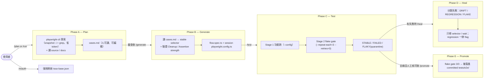

# QA Engine

AI 驅動的 QA 測試系統，透過 **Claude Code** 與 `npx playwright-cli`，對 web 應用執行系統性流程驗證。

**核心定位**：regression guard，不是 bug finder。五階段 workflow（Plan → Generate → Test → Heal → Promote），每階段產出獨立可稽核的檔案，中間可人工介入；只有通過 flake gate、被人工核可的 flow 才會 promote 進版控的 `tests/e2e/` 套件，成為持久的回歸基準。

---

## 架構

```
Claude Code
    ↕ slash commands (/plan /generate /test /heal /run /reauth /promote)
 Flow-Guard (defined in CLAUDE.md)
    ↕ Bash (Phase A / Phase D explore)
npx playwright-cli
    ↕
  Browser
    ↓
目標 Web App
```

**設定模型**：根目錄 `playwright.config.ts` 是唯讀 resolver（找最新 session，僅供本機方便），`playwright.config.base.ts` 是人工維護的 factory（`createSessionConfig`）。真正權威的是每個 session / 每個 committed flow 自帶的 `playwright.config.ts`。CI 與指定 session 一律帶 `--config`。

**setup chain**（由 Playwright `dependencies` 保證順序）：
```
tsso-setup  →  mock-user-setup  →  chrome | chrome-<role>
```

---

## 五階段 Workflow



| Phase        | 指令          | 輸入                                        | 輸出                                                |
| ------------ | ----------- | ----------------------------------------- | ------------------------------------------------- |
| A — Plan     | `/plan`     | target + (source) + (docs) + (locale)     | `cases.md`                                        |
| B — Generate | `/generate` | `cases.md`                                | `flow.spec.ts` + session `playwright.config.ts`   |
| C — Test     | `/test`     | `flow.spec.ts`                            | HTML report + JUnit + (quarantine.md)             |
| D — Heal     | `/heal`     | Phase C 失敗結果                            | 修好的 spec.ts + heal 報告 + `.patch`              |
| E — Promote  | `/promote`  | 全綠的 session                             | `tests/e2e/<slug>/`（committed 回歸套件）           |
| 全流程        | `/run`      | 同 /plan（可加 `heal:` / `gate:`）          | A→B→C（+D if heal）                                |
| 重新登入      | `/reauth`   | `.env` 憑證                                | `playwright/.auth/tsso-base.json`                 |

**為什麼分階段**：每階段單一職責、中間產物可審查可重跑。Heal 與 Promote 都獨立成階段，讓「修測試」「把這版行為簽成正確基準」這兩件事永遠在人能看見的邊界內進行。

---

## 指令說明

### `/plan` — Phase A：探索 → cases.md

```
/plan
target: http://localhost:3000
source: ../my-app/src    # optional — 白箱分析
docs: ./prd.md           # optional — PRD / spec
```

透過 `npx playwright-cli` 瀏覽目標 app，結合 source 與 PRD 產生 `cases.md`，完成後等候審查。探索採省 token 紀律：預設 `snapshot -i`（只回互動元素）、用 grep 找元素而非整份讀、每條 flow 設探索上限（見 `phase-a-explore.md`）。

### `/generate` — Phase B：cases.md → spec.ts

```
/generate <folder>    # 不帶則用最新
```

讀 `cases.md` 產生 `flow.spec.ts` 與 session `playwright.config.ts`（factory 呼叫）。會把 refs 轉成穩定 selector，並驗證每個 TC 的 **Cleanup** 欄位與 **outcome 斷言**（套套邏輯會被擋下並點名）。

### `/test` — Phase C：兩階段跑測試

```
/test <folder>
```
```
# Stage 1 功能跑
npx playwright test --config tests/generated/<ts>/playwright.config.ts
# Stage 2 flake gate（gate: false 可跳過）
npx playwright test --config tests/generated/<ts>/playwright.config.ts --repeat-each=3 --retries=0 --grep "<passed TCs>"
```

setup chain 依序 `tsso-setup → mock-user-setup → chrome[-role]`。結果分類為 **STABLE / FAILED / FLAKY**；flaky 寫進 `quarantine.md`，**不算綠**。完整 trace：`npx playwright show-report`。

### `/heal` — Phase D：分類失敗 → 修漂移、flag regression

```
/heal <folder>
```

讀 `test-results/`，先用 `playwright-cli` 重新探索拿 fresh snapshot，再把失敗分類：**DRIFT**（重解 selector）、**FLAKE**（只調等待）、**REGRESSION / TEST-DEFECT / AUTH**（不改、直接 flag）。修過的以 `--repeat-each=3` 重跑 3/3 才算修好。**絕不修改斷言、不加 skip/sleep 逼綠燈。**

### `/promote` — Phase E：flake gate → 進 committed 套件

```
/promote <folder>
```

先跑 flake gate（`--repeat-each=3 --retries=0`，必須 3/3），再把核可的 flow 從 gitignored 的 `tests/generated/` 複製進版控的 `tests/e2e/<slug>/`。失敗或 flaky 一律中止——絕不把不穩定的測試 commit 進去。重複 promote 同一 flow 即「更新」，`git diff tests/e2e/<slug>/cases.md` 就是行為變更的稽核軌跡。

### `/run` — 全流程

```
/run
target: http://localhost:3000
source: ../my-app/src
docs: ./prd.md
heal: true            # optional — Phase C 有失敗時自動接 Phase D（預設 false）
gate: true            # optional — 跑 Phase C flake gate（預設 true；false 給快速迭代）
```

依序 A → B → C（`heal:` 開則 C 後自動 D）。**Promote 永遠手動**，不納入 `/run`——把某版行為簽成正確基準應由人決定。

### `/reauth` — 重新整理登入狀態

手動強制刷新 `playwright/.auth/tsso-base.json`，不動 cases.md / spec.ts / session。

---

## 輸入參數

| 參數       | 必填 | 說明                                            |
| -------- | --- | --------------------------------------------- |
| `target` | 是  | 測試目標 URL（亦可由 `TARGET_URL` 提供）                 |
| `source` | 否  | 目標 app 的 source code 目錄（白箱分析，唯讀）             |
| `docs`   | 否  | PRD / spec 的 URL 或本地路徑                        |
| `locale` | 否  | 瀏覽器語系（預設 `zh-TW`）                             |
| `heal`   | 否  | `/run`：失敗時自動跑 Phase D（預設 false / `AUTO_HEAL`） |
| `gate`   | 否  | `/test` `/run`：跑 Phase C flake gate（預設 true）  |

---

## 設定

### 1. 安裝依賴

```
npm install                        # 含 @playwright/cli（playwright-cli 指令）
npm install -D @types/node         # 消除 config 的型別紅字
```
> 不需安裝 Chromium。所有測試使用系統 Chrome（`channel: 'chrome'`）。

### 2. 設定憑證

```
cp .env.example .env
```
```
TARGET_URL=http://localhost:3000
TSSO_USERNAME=...
TSSO_PASSWORD=...
AUTO_HEAL=false                    # optional — /run 預設是否自動 heal
```

---

## 目錄結構

```
qa-engine/
├── CLAUDE.md                     ← Flow-Guard 核心定義（五階段）
├── playwright.config.ts          ← 唯讀 resolver（指向最新 session，勿手改／勿被寫入）
├── playwright.config.base.ts     ← 人工維護的 factory（createSessionConfig）
├── package.json
├── .env.example
│
├── .claude/
│   ├── settings.json             ← 工具白名單（CLI-only）
│   ├── commands/
│   │   ├── plan.md
│   │   ├── generate.md
│   │   ├── test.md
│   │   ├── heal.md               ← /heal（Phase D）
│   │   ├── promote.md            ← /promote（Phase E）
│   │   ├── run.md
│   │   └── reauth.md
│   └── rules/
│       ├── cases-template.md     ← cases.md 結構（含 Cleanup + Assertion 規則）
│       ├── phase-a-explore.md    ← 省 token 探索紀律
│       ├── phase-b-generate.md   ← spec 生成（factory config）
│       ├── assertion-strength.md ← 斷言強度把關
│       ├── pattern-annotation.md
│       ├── dynamic-waits.md
│       ├── test-data-cleanup.md  ← 依 Cleanup 欄位生成 teardown
│       ├── flake-gate.md         ← Phase C / E 共用 flake gate
│       ├── phase-d-heal.md       ← Heal 決策樹
│       └── phase-e-promote.md    ← Promote（slug / copy / provenance）
│
├── playwright/
│   ├── setup/
│   │   └── tsso.setup.ts         ← 人工維護；tsso-setup project 執行
│   └── .auth/
│       └── tsso-base.json        ← TSSO 基礎 session（gitignored）
│
├── tests/
│   ├── generated/                ← 每次 run 產生（gitignored，臨時）
│   │   └── <YYYYMMDD-HHMMSS>/
│   │       ├── cases.md
│   │       ├── flow.spec.ts / flow.{role}.spec.ts
│   │       ├── playwright.config.ts        ← session 權威設定（factory 呼叫）
│   │       ├── mock-user.setup.ts
│   │       ├── mock-users.json
│   │       ├── quarantine.md               ← flaky TC（若有）
│   │       ├── heal-<HHMMSS>.patch         ← Phase D（若有）
│   │       └── .auth/state*.json
│   │
│   └── e2e/                      ← Phase E promote（committed 回歸套件）
│       └── <slug>/
│           ├── cases.md                    ← 行為契約 / 基準
│           ├── flow*.spec.ts
│           ├── playwright.config.ts        ← factory 呼叫
│           ├── mock-user.setup.ts
│           ├── mock-users.json
│           ├── PROVENANCE                  ← 來源 session + App 版本
│           └── .auth/state*.json           ← gitignored
│
├── playwright-report/
└── test-results/
```

`.gitignore` 重點：`tests/generated/` 整個 ignore；`tests/e2e/` commit，但 `tests/e2e/*/.auth/` 要 ignore（auth state 永不進版控）。

---

## CI

CI 跑**已 promote 的 committed 套件**，絕不叫 AI 即時生測試。一律用 `--config` 指向特定 flow：

```
# 跑全部已核可的 flow
for dir in tests/e2e/*/; do
  npx playwright test --config "$dir/playwright.config.ts"
done

# 單一 flow
npx playwright test --config tests/e2e/leave-request/playwright.config.ts
```

---

## 生命週期

```
/run（A→B→C，選擇性 D heal）→ 產生候選
        ↓ 人工審查
/promote → flake gate 3/3 → 進版控 tests/e2e/
        ↓
CI 之後只跑 tests/e2e/（持久回歸基準）
```

第一次某 flow promote 是「新增」；之後 App 改了、重跑、重 promote 就是「更新」，PR 上的 `git diff` 精準顯示被驗證的行為改了什麼——reviewer 審行為變更，跟審 code 一樣。